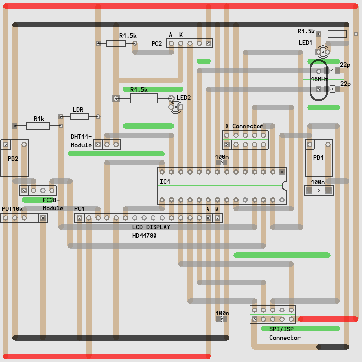

# ADConv

ADConv is the software for a weather station based on the ATmega8 initially

---

This is a continuously changing upstream version. If you want anything
more stable you can fall back to [v1.0][v1.0].

---

* Build on a strip grid board
* Cheap and easy construction
* Using external oscillator up to 16MHz
* + Connector for extensions

## Layout

Strip-Gridboard 100x100, RM2.54

## Get it
    git clone -b atmega8 https://github.com/manuel-io/adconv.git
    cd adconv
    git checkout -b build v1.0
    make
    make dispatch

## Construction elements

| Amount | Layout       | Element            | Reichelt        | Amazon                        |
|-------:|:---------------|:-------------------|:----------------|:------------------------------|
|1       | IC1            | ATmega8            | ATMEGA 8-16 DIP |                               |
|1       |                | Socket             | GS 28           |                               |
|1       | 16MHz          | Crystal            | 16,0000-HC49U-S |                               |
|1       | LED1           | LED Green          | LED 5MM GN      |                               |
|1       | LED2           | LED Red            | LED 5MM RT      |                               |
|1       |                | Board 100x100      | H25SR100        |                               |
|3       | R1.5k          | Resistor           | 1/4W 1,5K       |                               |
|1       | R1k            | Resistor           | 1/4W 1,0K       |                               |
|1       | LDR            | Photoresistor      | A 906011        |                               |
|1       | PB1            | Push-Button        | TASTER 3301B    |                               |
|1       | PB2            | Push-Button        | TASTER 3301B    |                               |
|1       | X-Connector    | Plug, straight     | WSL 10G         |                               |
|1       | SPI/ISP        | Plug, angled       | WSL 10W         |                               |
|3       | 100n           | Capacitor          | KERKO 100N      |                               |
|2       | 22p            | Capacitor          | KERKO 22P       |                               |
|1       | POT10k         | Potentiometer      | PO4M-LIN 10K    |                               |
|1       | PC1            | Pin header, female | BL 1X16G7 2,54  |                               |
|1       | PC2            | Pin header, female | BL 1X05G7 2,54  |                               |
|1       |                | Pin header, male   | MPE 087-1-016   |                               |
|1       | HD44780        | Display            | LCD 162C BL     | [1602 LCD Module][alcd]       |
|1       | DHT11 Breakout | DHT11 & Resistor   |                 | [Arduino DHT11 Module][adht]  |
|1       | FC-28 Breakout | FC-28 & Resistor   |                 | [Arduino FC-28 Module][afc28] |

## Datasheets

* [ATmega8](http://www.atmel.com/images/atmel-2486-8-bit-avr-microcontroller-atmega8_l_datasheet.pdf)
* [DHT11](https://akizukidenshi.com/download/ds/aosong/DHT11.pdf)
* [HD44780](https://www.sparkfun.com/datasheets/LCD/HD44780.pdf)

[v1.0]: https://github.com/manuel-io/adconv/tree/v1.0
[alcd]: https://www.amazon.de/gp/product/B009GEPZRE/ref=oh_aui_detailpage_o00_s00?ie=UTF8&psc=1
[adht]: https://www.amazon.de/gp/product/B017CWS1VS/ref=oh_aui_detailpage_o02_s00?ie=UTF8&psc=1
[afc28]: https://www.amazon.de/gp/product/B015CE4M2K/ref=oh_aui_detailpage_o02_s00?ie=UTF8&psc=1
