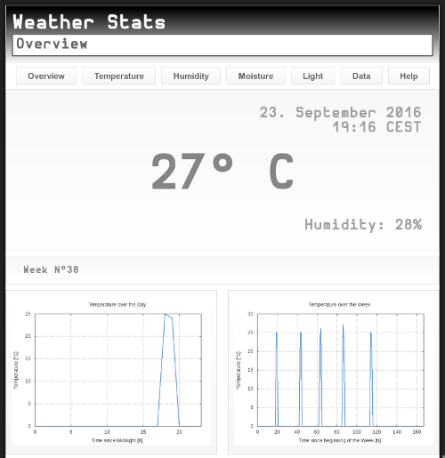

# ADConv

ADConv is the software for a weather station based on the ATmega8
initially

---

This is a continuously changing upstream version. If you want anything
more stable you can fall back to [v1.0][v1.0], [v2.0][v2.0],
[v3.0][v3.0].

---

* Build on a strip grid board
* Cheap and easy construction
* Using external oscillator up to 16MHz
* Connector for extensions (X Connector)

## Layout

Strip-Gridboard 100x100, RM2.54

## Get it

    git clone -b atmega8 https://github.com/manuel-io/adconv.git
    cd adconv
    git checkout -b build v3.0
    make
    make dispatch

1. Make sure you have the needed tools
  * soldering station, soldering wire, wire cutter, wire, etc
2. Order the construction elements
3. Assemble the circuit according to the schematics
4. Compile the software
5. Upload the compiled code to the controller
6. Start the web interface
7. Use the CP2102 Breakout in order to connect the board with the PC
  * use the board without serial connection, just wait until the
    timeout is triggered or set the DISABLE_XCON makro
8. Visit [http://localhost:9292](http://localhost:9292) in your browser

    cd adconv/share/xcon
    bundle install
    bundle exec bin/xconn.rb [-d device] [--no-stats] [--no-web] [-h]

## Construction elements

| Amount | Layout       | Element            | Reichelt        | Amazon                        |
|-------:|:-------------|:-------------------|:----------------|:------------------------------|
|1       | IC1          | ATmega8            | ATMEGA 8-16 DIP |                               |
|1       |              | Socket             | GS 28           |                               |
|1       | 16MHz        | Crystal            | 16,0000-HC49U-S |                               |
|1       | LED1         | LED Green          | LED 5MM GN      |                               |
|1       | LED2         | LED Red            | LED 5MM RT      |                               |
|1       |              | Board 100x100      | H25SR100        |                               |
|3       | R1.5k        | Resistor           | 1/4W 1,5K       |                               |
|1       | R1k          | Resistor           | 1/4W 1,0K       |                               |
|1       | LDR          | Photoresistor      | A 906011        |                               |
|1       | PB1          | Push-Button        | TASTER 3301B    |                               |
|1       | PB2          | Push-Button        | TASTER 3301B    |                               |
|1       | X Connector  | Plug, straight     | WSL 10G         |                               |
|1       | SPI/ISP      | Plug, angled       | WSL 10W         |                               |
|3       | 100n         | Capacitor          | KERKO 100N      |                               |
|2       | 22p          | Capacitor          | KERKO 22P       |                               |
|1       | POT10k       | Potentiometer      | PO4M-LIN 10K    |                               |
|1       | PC1          | Pin header, female | BL 1X16G7 2,54  |                               |
|1       | PC2          | Pin header, female | BL 1X05G7 2,54  |                               |
|1       |              | Pin header, male   | MPE 087-1-016   |                               |
|1       | HD44780      | Display            | LCD 162C BL     | [1602 LCD Module][alcd]       |
|1       | DHT11 Module | DHT11 Breakout     |                 | [Arduino DHT11 Module][adht]  |
|1       | FC-28 Module | FC-28 Breakout     |                 | [Arduino FC-28 Module][afc28] |
|1       |              | CP2102 Breakout    |                 | [CP2102 Breakout][cp]         |

## SPI/ISP Interface

[In-System Programming][isp] allows programming and reprogramming of
the microcontroller positioned inside the end system. For example,
using the [USBasp][asp].

## CP2102 Breakout

The CP2102 Breakout is a USB to TTL converter intended for replacing a
simple serial cable.

## XConn

The XConnector (Extension connector) is a general purpose plug with 9
pins including the USART data lines of the microcontroller. The
default usage is a serial UART connection to another device.

| XConn | CP2102 Breakout |
|:------|:----------------|
|VCC    | VCC             |
|GND    | GND             |
|RXD    | TXO             |
|TXD    | RXI             |
|NC     | DTR             |
|NC     | CTS             |

* According to the datasheet the CP2102 chip is 5V tolerant!
* NC: Not connected.

For instance, the measured weather data can be transmitted to a
Raspberry Pi, a BeagleBoard or similar. The source base includes a web
interface which is ready for that scenario.

## SClient

The SClient is a small program in order to simulate the behavior of a
serial connected microcontroller. It just gives randomly weather data
to a virtual serial interface which in turn can be analysed by the web
interface.

This program exists for testing purpose:

    cd adconv/share/sclient/
    make
    cd ../../../
    socat pty,raw,echo=0,link=/tmp/ttyS20 pty,raw,echo=0,link=/tmp/ttyS21
    ruby adconv/share/xconn/bin/xconn.rb
    ./adconv/share/sclient/sclient

## Datasheets

* [ATmega8](http://www.atmel.com/images/atmel-2486-8-bit-avr-microcontroller-atmega8_l_datasheet.pdf)
* [DHT11](https://akizukidenshi.com/download/ds/aosong/DHT11.pdf)
* [HD44780](https://www.sparkfun.com/datasheets/LCD/HD44780.pdf)
* [CP2102](https://www.sparkfun.com/datasheets/IC/cp2102.pdf)

[v1.0]: https://github.com/manuel-io/adconv/tree/v1.0
[v2.0]: https://github.com/manuel-io/adconv/tree/v2.0
[v3.0]: https://github.com/manuel-io/adconv/tree/v3.0
[alcd]: https://www.amazon.de/gp/product/B009GEPZRE/
[adht]: https://www.amazon.de/gp/product/B017CWS1VS/
[afc28]: https://www.amazon.de/gp/product/B015CE4M2K/
[cp]: https://www.amazon.de/gp/product/B008RF73CS/
[isp]: http://www.atmel.com/images/doc0943.pdf
[asp]: http://www.fischl.de/usbasp/
